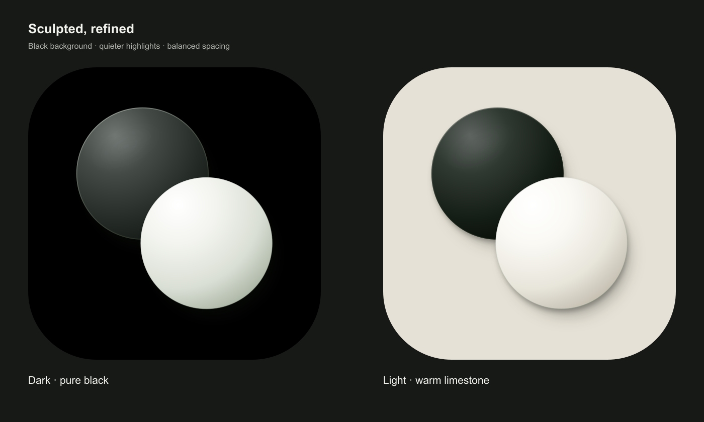

# GoStone Sculpted icons

These are the user-approved, refined Sculpted logo masters. Use this folder as
the source for future website, native app, and store artwork. Keep the simple
overlapping black and white stones, subtle edge lighting, and soft shadows.
Always include a dark version when creating variants or previews.

## Files

| Use | Dark | Light |
| --- | --- | --- |
| App icon, SVG master | [gostone-sculpted-dark-app.svg](gostone-sculpted-dark-app.svg) | [gostone-sculpted-light-app.svg](gostone-sculpted-light-app.svg) |
| App icon, 1024 × 1024 PNG | [gostone-sculpted-dark-app.png](gostone-sculpted-dark-app.png) | [gostone-sculpted-light-app.png](gostone-sculpted-light-app.png) |
| Transparent logo, SVG master | [gostone-sculpted-dark.svg](gostone-sculpted-dark.svg) | [gostone-sculpted-light.svg](gostone-sculpted-light.svg) |
| Transparent logo, 2048 × 2048 PNG | [gostone-sculpted-dark.png](gostone-sculpted-dark.png) | [gostone-sculpted-light.png](gostone-sculpted-light.png) |

## Usage

- Use the `-app` files for app icons. They include square, opaque backgrounds:
  pure black (`#000000`) for dark mode and warm limestone (`#e6e1d6`) for light
  mode. The PNGs are RGB with no alpha channel. Let the operating system apply
  the icon's corner mask.
- Use the transparent files for website headers and other logo placements.
  The dark logo has extra edge lighting so the black stone remains visible
  on dark surfaces. Use the light logo on light surfaces.
- Resize the complete square proportionally. Preserve the stones' overlap
  and the surrounding space; use the SVG masters when generating new sizes.
- Native icon catalogs, website icon metadata, and store uploads use their own
  destination files. Copy or derive those assets from these masters when
  implementing an icon update.

Release-specific screenshots and generated uploads live under
`artifacts/release/<version>-<build>/store-assets/`, which is ignored by Git.
The approved masters in this folder are tracked so other agents and checkouts
can reuse them.
